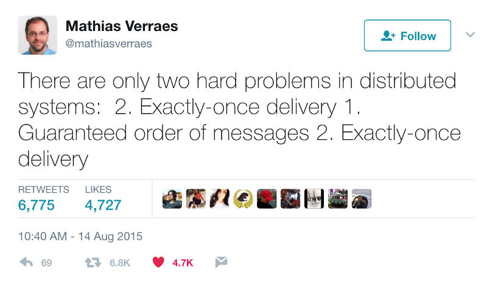

## A Practical Guide To Kafka & Spring-Kafka 

### What is Kafka?
- Kafka is "an open-source distributed event streaming platform" originally developed by Jay Kreps, Neha Narkhede and Jun Rao at LinkedIn and open-sourced in 2011
- When using existing traditional Message Oriented Middleware (MOM( Throughput was a major problem for LinkedIn so in designing Kafka the team set out to be build a technology which was high-throughput but also highly-scalable and fault-tolerant
- Kafka differs from traditional Message Oriented Middleware (e.g. IBM MQ, ActiveMQ, RabbitMQ, Solace, TibcoRV etc) in that it does not implement the Java Message Service (JMS) API and does not provide point-to-point (P2P) messaging but rather a purely pub/sub model (i.e. topics). For more on JMS vs Kafka see https://www.kai-waehner.de/blog/2022/05/12/comparison-jms-api-message-broker-mq-vs-apache-kafka/
- Out-of-the-box, Kafka is also non-transactional. (Transactions were introduced in Kafka 0.11.0 in 2017 to allow for *exactly-once* semantics but transactions gets very complicated!)

### Event-Streaming & Event-Drivnn Architectures
- An event-stream is typically a time-series representing the changing state of a particular business entity Examples of event streams: geo-location (e.g. Uber, UberEats or flight-tracking), price data (e.g. time-stamped or live stock prices or other real-time financial data/analytics) or retail inventory management (tracked using RFID)
- Event-streaming also sits nicely with reactive streams (https://www.reactive-streams.org/) whereby data is representing not as a snapshot at a particular time but a stream of continuous, ever-changing data originating from producers/publishers and consumed resiliently by consumers/sinks using backpressure (See https://medium.com/@jayphelps/backpressure-explained-the-flow-of-data-through-software-2350b3e77ce7)
- In last 15 years there has been move towards asynchronous event-driven microservice architectures based on both data streams and business events being published via an event-bus leading to loosely-coupled consumers
- The term 'Event-Driven Architectures' (EDA) is somewhat ambiguous. You could argue web apps are event-driven (e.g. DOM events) and so are traditional GUI apps (e.g. Java Swing) but usually the events here are identifiable business events (e.g. order-placed, order-fulfilled, payment-attempted, payment-confirmed) or system events (e.g. service-shutting-down). It's worth listening to Martin Fowler talk about the ambiguities of EDA as a term (see https://youtu.be/STKCRSUsyP0) and the various industry interpretations.

### Kafka As An Event Bus
- At Discover, we treat Kafka as event bus. An event bus is an architectural patterns which allows publish/subscribe-style communication between microservices without requiring the components to explicitly be aware of each other
- Think of the event-bus as the central nervous system of not just an microservice/application but an eco-system of related services. For more on the event bus pattern see https://learn.microsoft.com/en-us/dotnet/architecture/microservices/multi-container-microservice-net-applications/integration-event-based-microservice-communications
- Leveraging Kafka's pub-sub model, it becomes really easy for other subsystems to listen to events and act upon them: you just need to write a consumer which is part of its own consumer group to consume from the topic
- Because it's very easy for anyone to write/consume to Kafka topics, we need to prevent all-out anarchy and thereby we enforce permissioning to give visibility to which services are publishing/consuming to what topics

### Brokers, Partitions, Topics, Offsets, Consumers & Consumer Groups
- A Kafka **Cluster** is made up of a collection of brokers. For normal production use, there are *at least* 3 brokers in the cluster.
- Each **Broker** has a numeric id and, as a client, when you are connected to an individual broker you are connected to the cluster.
- Each broker is also **Bootstrap Broker** which allows you to connect to the cluster(. The brokers hold metadata about all the other brokers topics, partitions etc. in the cluster in metadata.)
- **Topics** are what messages (or 'records') are published to (so if you're familiar with database you can think of topic like a db table). Note if you're writing a topic that doesn't exist then Kafka will auto create the topic if autocreate is set to true (`auto.create.topics.enable=true`)
- **Records** - not messages !- are written to topics and cannot be deleted or modified once they are sent to Kafka by a producer (this is actually known as “*distributed commit log*”)
- The **Offset** is an incrementing, immutable integer that is used by Kafka to maintain the current position of a consumer. Offsets only have meaning in a partition and ordering is only maintained per partition (not across partitions). Consumer offsets are held in a topic `__consumer_offsets` so if consumer dies then it knows where it left off. (Offsets used to be held in Zookeeper in early versions of Kafka but no longer)
- Each topic is divided into numbered **partitions** which are distributed across brokers. You need to specify the number of partitions when you create the topic so choosing the number of partitions for your topic is important!
- Each partition has one **partition leader** and that is elected by Zookeeper. In the event of a broker failure then a new leader is elected but if that broker is restored it will become leader again
- The **In-Sync Replica** (ISR) is a replicated partition (there are multiple ISRs for topic) – see `min.insyc.replicas` on producer config (this is usually set to 3 which allows for two replicating brokers to go down; if we set it to 1 and brokers goes down we'll get `NotEnoughReplicas` exception.) The role is the ISR is to ensure replicated partitions that are completely synced up with the leader.
- A **Key** is optionally send with a record. If a key is null then broker round robins across partitions but if they key is the same then records are written to the same partition (key hashing). ***So long as the number of partitions remains constant for a topic (no new partitions) then the same key will always go to the same partition.*** Example: for monitoring trucks we'd use the truckId for the key and then we'd get data in order (but ordering is only per partition). Keys are hashed using murmur2 (provides good distribution) to derive the partition to be written to (so same key always go to same partition and why we can't change number of partitions later) and you can (but not advised) override the hashing by overriding DefaultPartitioner. The default is: `targetPartition = Utils.abs(Utils2.murmur2(record.key())) % numPartitions`
- Each consumer is prt of a **ConsumerGroup** which reads from exclusive partitions. (If more consumers than partitions then they'll be inactive – we might want this as backup but usually at least as many consumer). Consumers know how to coordinate reading from partitions. If we want a high number of consumers then we need a high number of partitions!
- For each consumer group there is a **ConsumerCoordinator** which performs rebalancing of consumer groups and partitions. (Such activity usually appears in logging,)

### Why Does Kafka Require Apache Zookeeper?
- **Metadata**: Zookeeper maintains **metadata** about the Kafka cluster (e.g. information about topics, partitions, replicas, and the location of each replica)
- **Leader Election**: Kafka brokers (servers) are organized into a cluster, and each partition of a topic has a leader broker and one or more follower brokers. Zookeeper chooses and the leader (using the Raft consensus algorithm) and if that leader broker for a partition fails then Zookeeper is responsible to electing a new leader
- **Configuration**: Certain configuration parameters are stored in Zookeeper (e.g. topics, brokers, and other cluster-wide configurations)
- **Broker Registration**: When a Kafka broker starts or stops, it registers itself with Zookeeper. This information is used for discovery of brokers by other components in the cluster.
- **Quotas and Access Control Lists (ACLs)**: Zookeeper can be used to enforce quotas and ACLs to control access to Kafka resources.
- **Detecting Broker Failures**: Zookeeper helps in detecting when a Kafka broker becomes unavailable. This information is crucial for reassigning partitions to other brokers if needed.
- **Storing Offset Information**: Consumer offset information is also stored in Zookeeper by default (although Kafka 0.10.2.0 and later versions allow offset storage in Kafka itself using the __consumer_offsets topic).
  **Detecting Broker Failures**: Zookeeper helps in detecting when a Kafka broker becomes unavailable. This information is crucial for reassigning partitions to other brokers if needed.
- **Storing Offset Information**: Consumer offset information is also stored in Zookeeper by default (although Kafka 0.10.2.0 and later versions allow offset storage in Kafka itself using the __consumer_offsets topic).
- **Group Coordinator for Consumers**: Kafka uses Zookeeper to keep track of which broker is currently acting as the group coordinator for a particular consumer group. This is essential for maintaining consumer group membership.
- **Synchronization and Locking**: Zookeeper provides distributed locks and synchronization primitives that Kafka uses to ensure that operations are coordinated across the cluster.
- **Handling Network Partitions**: Zookeeper helps Kafka in handling network partitions gracefully. It ensures that the system continues to operate even if some nodes are temporarily unreachable.

### How does Kafka achieve Scalability, Fault-tolerance and High Throughput?
- Scalability is achieved in Kafka via partitioning. Records are written across multiple partitions of a topic and then multiple consumers are grouped (via a consumer group) to read concurrently from those partitions. (In your more familiar with databases then think of sharding where big data sets are broken up into two or more smaller chunks, called logical shards.)
- Kafka achieves **fault-tolerance** by replication. In Kafka, partition data is copied to other brokers, which are known as *replicas*. If there's a point of failure in partition data in one node, then other nodes that will provide a backup and ensure that the data is still available. Replication provides fault tolerance by ensuring published messages are not permanently lost. Even if a node fails and they are lost on one node then there is a replica present on another node that can be recovered. A topic's **replication factor** is the number of copies of the topic that are present over multiple brokers. Replication factor should be >1 for fault tolerance. In such cases, there'll' be a replica of data in another broker from where the data can be retrieved.
- Throughput by can tuned according to the needs of the environment via..
  - Scaling the appropriate number of consumers inside a consumer group (but this will require consumer-group re-balancing)
  - Choice of *serialization protocol* (e.g. using a binary serialization like Avro or Thrift compresses the message size compared to, say, plaintext JSON - it's important to recognize that the Kafka brokers don't know anything about the contents of messages and once data is travelling inside the cluster then Kafka uses its own binary protocol aka Kafka Wire Protocol over TCP - see https://kafka.apache.org/protocol.html)
  - To optimize throughput Kafka works with *batches* of records both on the producer and consumer side. (Kafka's documentation stresses "Our APIs encourage batching small things together for efficiency. We have found this is a very significant performance win."). On the producer side there's `linger.ms` (max time producer wait before sending a batch) and `batch.size`. On the consumer side there's `max.poll.records`, `max.poll.interval.ms`, `fetch.max.bytes` and `fetch.max.wait.ms` settings allowing you to tune to consumer's throughput
  - Tuning brokers via `num.network.thread`s, `num.io.threads`, and `socket.send.buffer.bytes` to match network, hardware and workload
  - Tuning ack modes (e.g `acks=0` is used to max throughput but can lead to data loss)
  - Using async producers and batching the messages a producer sends

### Autoscaling Using HPA and Kafka
- Kubernetes has a feature called Horizontal Pod Autoscalng (HPA) which will automatically adjusts the number of pods in a deployment or replication controller based on observed CPU utilization (or other custom metrics)
- For services which are REST-based Kubernetes is smart enough to figure out when a service is about to be maxed out and, therefore, to increase the number of replicas to spread that load (via round-robin load-balancing)
- For kafka-based services this is potentially problematic: scaling up more replicas means more consumers joining a consumer group and this requires consumer-group rebalancing
- When consumer-group rebalancing occurs then consumers within the consumer group are potentially re-allocated to different partitions
- Consumer-group rebalancing is a stop-the-world event in Kafka so whilst the re-balancing occurs records will not be consumed from the topic by any consumers assigned to that topic which in turn will lead to a spike in latency

### Things To Think About When Configuring And Turning Kafka
- **Criticality of Messages**: If you event stream is geo-spatial data (e.g. an UberEats delivery driver) then dropping an event is not a big deal because you'll get another event very soon after. Sometimes the same can be true of fast-ticking financial price data. If your event, however, is a $100m interest rate swap being booked and you drop that message then you have a big problem! Design your robustness according to throughput *and* criticality. Are you getting lots of messages which individually are of relatively low-importance or are you consuming low volumes events of high importance?
- **Predictability of Load**: is the amount of records written to your topic roughly predictable and constant or do you see big spikes? Is there a pattern to the spikes? How important is it to your business needs than spikes do not lead to longer latency times?
- **Tuning batch size, linger and thread count**: You need to tune your batch size and timeouts accordingly. You don't want to be lingering too long waiting for records and you want to tune your batch size to get the best performance (batch size can very much depends on the size of your payload.) Also consider turning the the thread count in `Spring-Kafka` to optimize performance.

### Delivery Semantics
- **at-most-once** - offsets are committed as soon as a message batch is received after calling poll(). If the subsequent processing fails, the message will not be tried and is lost.
- **at-least-once** - every event from the source system will reach its destination, but sometimes retries will cause duplicates. In thie case, offsets are committed *after* the message is processed. If  processing goes wrong, the message will be read again (but this can result in duplicate processing)
- **exactly-once** - each message is delivered exactly once. In order to achieve this, Kafka and the consumer application need to cooperate to make exactly-once semantics happen.

### Two Big Problems: Exactly Once Delivery And Guaranteed Ordering
- Software consultant, Mathias Verraes, sent this rather witty tweet back in 2015 which summarizes two central problems to complex message-oriented systems. In a distributed environment with multiple instances of services consuming (in a multi-threaded environment) then it's often the case you'll have to design your code to handle possible duplicates and retrying on errors. You also need to be aware of whether it's a requirement for your system to process messages in strict sequence and if this is the case you will have to design accordingly.

- If you require **guaranteed ordering** then it's tricky and you're going to have to sacrifice some throughput:
  - Ensure you use the same key for the messages you want to order. (By default, Kafka will write messages with the same hash of the key to the same partition)
  - Kafka's default hash-based partitioner might not guarantee ordering so you might even consider implementing your own partitioner
  - Ensure that you have a single consumer in each consumer group 
  - Set `max.in.flight.requests.per.connection` to 1
  - Carefully consider errors/retries or you could start processing out of sequence
- For *exactly-once* semantics then you'll need to implement your own guarantees
    - **Idempotent Guarantee**: This restricts Exactly-Once Processing on a single Topic-Partition and within a single producer session. Exactly-Once Processing is not guaranteed when the producer is restarted.
    - **Transactional Guarantee**: This ensures Exactly-Once processing on multiple Topic-Partitions and also supports Exactly-Once Processing across multiple p
- It's better to avoid transactions in Kafka if at all possible but see Confluent's page for more details on achieving exactly-once delivery semantics https://www.confluent.io/en-gb/blog/exactly-once-semantics-are-possible-heres-how-apache-kafka-does-it/ 
- If you do decide you need exactly-once semantics then consult the Spring documentation on [how to implement](https://docs.spring.io/spring-kafka/docs/current/reference/html/#exactly-once) as you'll need to configure a `KafkaAwareTransactionManager`

### Idempotency
- **Idempotency** is a property of an operations such that no matter how many times you execute that operation, you achieve the same result (e.g multiplying by one, multiplying by zero). If you're familiar with Functional Programming (FP) then an idempotent function is different from pure function in so far as it permits side effects.
- In order to deal with the problem of duplicates and to avoid the thorny issue of achieving  **exactly-once** semantics it is preferable to design consumers and producer to be idempotent
- Producer idempotence can be enabled for Kafka versions >= 0.11 using the `enable.idempotence` flag (More details see https://www.conduktor.io/kafka/idempotent-kafka-producer/)
- To implement an idempotent consumer you need some idea of whether the message has already been processed. In some cases this may not matter but in other cases it may lead to undesirable side-effects (e.g. a SQL update can, in most cases, be applied twice with no effect but a SQL insert applied twice would lead to a duplicate record so in the case of the latter it is best to use Postgres IF NOT EXISTS - see https://www.commandprompt.com/education/postgresql-insert-if-not-exists ) 
- Think carefully about your implementation and failure conditions. You have to be able to handle retries but also avoid duplicates!

### Spring-Kafka
- When using Spring Boot we rely on Spring's abstractions rather than interacting directly with "raw" Kafka representions such as `org.apache.kafka.clients.consumer.KafkaConsumer<K,V>` or `org.apache.kafka.clients.producer.KafkaProducer<K,V>`
- At the time of writing `spring-kafka` was on v3.0.x and has documentation [here](https://spring.io/projects/spring-kafka)
- The most important Spring abstractions for Kafka are:
  - `org.springframework.kafka.core.ConsumerFactory` and `org.springframework.kafka.core.ProducerFactory` which are factories/strategies for producing Kafka Consumers and Producers respectively. (This will be part of your configuration)
  - `org.springframework.kafka.core.KafkaTemplate` which has `send(String topic, K key, V data)` and `send(String topic, V data)` methods for producing to a topic and which both return `CompletableFuture<SendResult<K,V>>` 
  - `org.springframework.kafka.requestreply.ReplyingKafkaTemplate` is an abstraction introduced in Spring-Kafka 2.1.3 for Request-Reply semantics. This is sometimes called [synchronous Kafka](https://dzone.com/articles/synchronous-kafka-using-spring-request-reply-1) because the producer which is waiting for a reply can potentially block the thread until a reply is received or until a timeout occurs.  If the timeout is reached before a reply is received, the template will throw a TimeoutException. It's therefore very important to set an appropriate timeout value to avoid potential thread blocking indefinitely. 
  - `org.springframework.kafka.annotation.KafkaListener` is an annotation used to annotate a listener method which will be invoked when a record on the configure topic is received:
  
### Consumer Retry Strategies

https://www.baeldung.com/spring-retry-kafka-consumer

### Handling Acknowledgements
- An **acknowledgment** (often referred to as an "ack") is a signal sent by a consumer to indicate that it has successfully received and processed a message or by the producer. Acknowledgements are, therefore, part of the reliability mechanism in Kafka. In "raw" Kafka there are three levels of ack:
- In "raw" Kafka there are different levels of acknowledgment on the **Producer side**:

- `acks=0`:  The producer will not wait for any acknowledgment from the broker after sending the message. This mode offers the lowest level of reliability. The producer assumes that the message has been delivered successfully, even though it might not have reached the broker.
- `acks=1`: This requires the leader broker to acknowledge that it has received the message. The leader will respond to the producer as soon as the message is written to its local log. This mode provides a reasonable level of reliability, as it ensures that the message has been received by the leader.
- `acks=all` or `acks=-1`: This equires acknowledgment from all in-sync replicas (ISRs) before the producer considers the message as successfully delivered. This mode provides the highest level of reliability, as it ensures that the message is safely stored on multiple replicas.

- Choice of acknowledgment level depends on the trade-off between *latency* and *reliability* that your application can afford:
  - `acks=0` provides the lowest latency but the lowest reliability.
  - `acks=1` balances latency and reliability, making it a common choice for many use cases.
  - `acks=all` provides the highest level of reliability but may have higher latency due to the additional replication and acknowledgment process. (Even with `acks=all`, there are scenarios where messages can still be lost (e.g., if all replicas fail before the message is replicated) so it's important to have proper monitoring, error handling, and retry mechanisms in place regardless of the acknowledgment level chosen.)

- On the **consumer side** here are three basic acknowledgement modes:
  - **Auto-commit**: the consumer sends an acknowledgment to the broker as soon as it receives a message - this can lead to potential [data loss](https://newrelic.com/blog/best-practices/kafka-consumer-config-auto-commit-data-loss) so not recommended for messages of high criticality
  - **After-processing**: the consumer only sends an acknowledgment to the broker after it has successfully processed the message 
  - **Manual**: the consumer waits until it receives specific instructions before sending an acknowledgment to the broker

- In spring-kafka, the `AckMode` which is configured on the `ConcurrentKafkaListenerContainerFactory` determines when the broker updates the consumer’s offset.

  - `AckMode.RECORD` - the consumer sends an acknowledgment for each message it processes
  - `AckMode.BATCH` - the consumer sends an acknowledgment for a batch of messages rather than for each message
  - `AckMode.COUNT` - the consumer sends an acknowledgment after it has processed a specific number of messages
  - `AckMode.MANUAL` - in this manual mode, the consumer doesn’t send an acknowledgment for the messages it processes
  - `AckMode.TIME` -  the consumer sends an acknowledgment after a certain amount of time has passed
