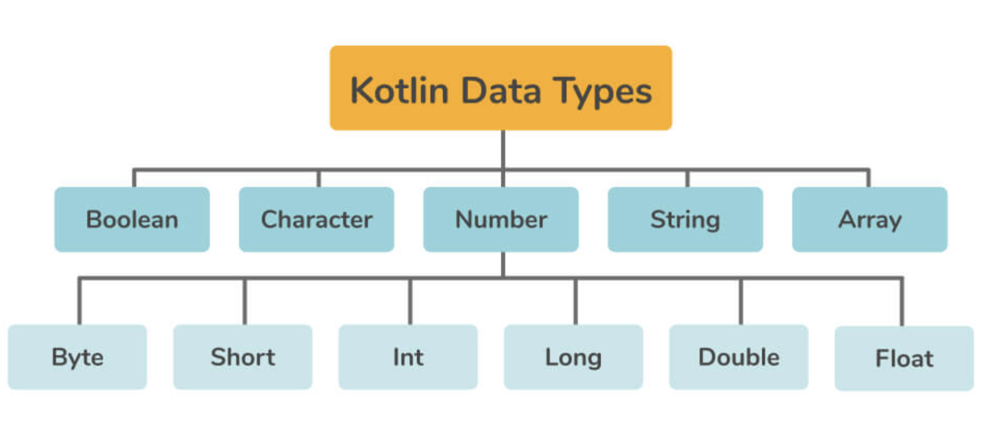

## Kotlin Interview Questions

1. **Data Types**
- 

| Integer  | Length  |
|----------|---------|
| byte     | 8 bits  |
| short    | 16 bits |
| int      | 32 bits |
| long     | 64 bits |

| Floating point | Length  |
|----------------|---------|
| float          | 32 bits |
| float          | 64 bits |


| Other   | Length |
|---------|--------|
| Boolen  | 1 bit  |
| char    | 8 bits |
| String  | Depends |
| Array   | Depends |


2. **Declaring Variables**

| Typ  | Length                                     |
|------|--------------------------------------------|
| val  | Immutable / read-only  (but not a constant |
| var  | Mutable / value can changed                |


3.  **Data Classes**

- `equals()` - The equals() function returns true if two objects have the identical contents. It operates similarly to "==," although for Float and Double values it works differently
- `hashCode()` - The hashCode() function returns the object's hashcode value
- `copy()` - The copy() function is used to duplicate an object, changing only a few of its characteristics while leaving the rest unaltered
- `toString()` - This function returns a string containing all of the data class's parameters
For consistency we must 
- At least `one parameter` is required for the primary constructor
- `val` or `var` must be used for all primary constructor parameters
- Abstract, open, sealed, or inner data classes are not possible
- Only interfaces may be implemented by data classes


4.  **Null Safety**
- Kotlin's type system distinguishes between references that can hold null (nullable references) and those that cannot (non-null references)
- Null cannot be stored in a `String` variable => must use `String?`
- Kotlin provides Safe Call (`?.`), Elvis (`?:`) and Not Null Assertion (`!!`) operators which define what needs to be done in case of a null encounter. This makes the code more reliable and less prone to errors. 
- Kotlin enforces null safety by having nullable, non-nullable type variables and the different operators to tackle null encounters.

| Operator                           | Usage                                                                                    |
|------------------------------------|------------------------------------------------------------------------------------------|
| Safe call (`.?`)                   | Only does an action when a specified reference holds a non-null value                    | 
| Elvis Operator (`?:`)              | Used to return a non-null value or a default value                                       | 
| Not Null Assertion Operator (`!!`) | If the value is null, the not null assertion (!!) operator changes it to a non-null type |


5. **Kotlin vs Java**

| Basis	                     | Kotlin                                                                                                                                                                                                                                                                                                              | Java                                                                                                                                                                                                                                                                                                 |
|----------------------------|---------------------------------------------------------------------------------------------------------------------------------------------------------------------------------------------------------------------------------------------------------------------------------------------------------------------|------------------------------------------------------------------------------------------------------------------------------------------------------------------------------------------------------------------------------------------------------------------------------------------------------|
| **Null Safety**            | By default, all sorts of variables in Kotlin are non-nullable (that is, we can't assign null values to any variables or objects). Kotlin code will fail to build if we try to assign or return null values. If we absolutely want a null value for a variable, we can declare it as follows: value num: Int? = null | NullPointerExceptions are a big source of annoyance for Java developers. Users can assign null to any variable, however, when accessing an object reference with a null value, a null pointer exception is thrown, which the user must manage.                                                       |
| **Coroutines Support**     | We can perform long-running expensive tasks in several threads in Kotlin, but we also have coroutines support, which halt execution at a given moment without blocking threads while doing long-running demanding operations.                                                                                       | The corresponding thread in Java will be blocked anytime we launch a long-running network I/0 or CPU-intensive task. Android is a single-threaded operating system by default. Java allows you to create and execute numerous threads in the background, but managing them is a difficult operation. |
| **Data Classes**           | If we need to have data-holding classes in Kotlin, we may define a class with the keyword "data" in the class declaration, and the compiler will take care of everything, including constructing constructors, getter, and setter methods for various fields.                                                       | Let's say we need a class in Java that only holds data and nothing else. Constructors, variables to store data, getter and setter methods, hashcode(), function toString(), and equals() functions are all required to be written explicitly by the developer.                                       |
| **Functional Programming** | Kotlin is procedural and functional programming (a programming paradigm where we aim to bind everything in functional units) language that has numerous useful features such as lambda expressions, operator overloading, higher-order functions, and lazy evaluation, among others.                                | Java does not allow functional programming until Java 8, however it does support a subset of Java 8 features when developing Android apps.  |
| **Extension Functions**    | Kotlin gives developers the ability to add new functionality to an existing class. By prefixing the name of a class to the name of the new function, we can build extended functions.                                                                                                                               | In Java, we must create a new class and inherit the parent class if we want to enhance the functionality of an existing class. As a result, Java does not have any extension functions.                                                   |
| **Data Type Inference**    | We don't have to declare the type of each variable based on the assignment it will handle in Kotlin. We can specify explicitly if we want to.                                                                                                                                                                       | When declaring variables in Java, we must declare the type of each variable explicitly.                                                                                                                                                                                           |
| **Smart Casting**          | Smart casts in Kotlin will take care of these casting checks with the keyword "is-checks," which checks for immutable values and conducts implicit casting.                                                                                                                                                         | We must examine the type of variables in Java and cast them appropriately for our operation.                                                                                                                                                                        |
| **Checked Exceptions**     | We don't have checked exceptions in Kotlin. As a result, developers do not need to declare or catch exceptions, which has both benefits and drawbacks.                                                                                                                                                              | We have checked exceptions support in Java, which enables developers to declare and catch exceptions, resulting in more robust code with better error handling.                                                                                                          |

6. **Constructors**
- **Primary Constructor** is initialised in the class header and is provided after the class name. It is declared using the “constructor” keyword
- **Secondary Constructor** allows for the initialization of variables as well as the addition of logic to the class. They have the constructor keyword prefixed to them. For example,

7. **Iterating**
- `for(n in num)` Loop
- `while(t){}` Loop
- `do {} while(t)` loop

8.  **String concatenation**
- String interpolation using `${}`
- Using `+` or `.plus()`
- Using `StringBuilder`

9.  **Extension Functions**
- In Kotlin, we can add or delete method functionality using extensions, even without inheriting or altering them. Extensions are statistically resolved. It provides a callable function that may be invoked with a dot operation, rather than altering the existing class
- **Function Extension** allows users to specify a method outside of the main class via function extension

10. **Companion Objects**
- There is nothing called the `static` keyword. So, if we want to achieve the functionality of static member functions, we use the companion objects. (This is also referred to as Object Extension.)

11. **Differentiate between `open` and `public` keywords**
- Keyword `open` refers to the term "open for expansion" and is the opposite of the final annotation in Java: it allows others to inherit from it
- By default, a class cannot be inherited in Kotlin
- In Kotlin, an `open method` signifies that it can be *overridden*, whereas it cannot be by default. Instead, any methods in Java can be overridden by default.

12. Replace `switch` with `when`
```kotlin
 var temp = "Interview"
   when(temp) {
       "Interview" -> println("Interview Bit is the solution.")
       "Job" -> println("Interview is the solution.")
       "Success" -> println("Hard Work is the solution.")
   }
```

13. **Advantages of Kotlin Over Java**
- **Data class**: In Java, you must create getters and setters for each object, as well as properly write hashCode (or allow the IDE to build it for you, which you must do every time you update the class), toString, and equals. Alternatively, you could utilize lombok, but that has its own set of issues. In Kotlin, data classes take care of everything.
- **Patterns of getter and setter**: In Java, for each variable, you use it for, rewrite the getter and setter methods. You don't have to write getter and setter in kotlin, and if you must, custom getter and setter take a lot less typing. There are additional delegates for identical getters and setters.
- **Extension Function**s: In Java, there is no support for extension functions. Kotlin on the other hand provides support for extension functions which makes the code more clear and cleaner.
- **Support for one common codebase**: You may extract one common codebase that will target all of them at the same time using the Kotlin Multi-Platform framework.
- **Support for Null Safety**: Kotlin has built-in null safety support, which is a lifesaver, especially on Android, which is full of old Java-style APIs.
- **Less prone to errors**: There is less space for error because it is more concise and expressive than Java.

14. **ImmutableList or MutableList?**
- *Design clarity* is improved by using mutable and immutable lists- lets the developer think about and clarify the collection's purpose.
-  `Val` and` var` serve a different purpose: the val and var keywords specify how a variable's value/reference should be handled. 
   - `var` when the value or reference of a variable can be altered at any moment
   - `val` when a variable's value/reference can only be assigned once and cannot be modified later in the execution
- Immutable lists are frequently preferred for a variety of reasons:
   - **Promote functional programming** => state is passed on to the next function, which constructs a new state based on it, rather than being altered. This is evident in Kotlin collection methods like `map`, `filter`, `reduce`, and so forth.
   - **Easier to understand and debug** software that doesn't have any side effects (you can be sure that the value of an object will always be the one at its definition)
- Disadvantages
   - Copying large collections simply to add/remove a single piece is very expensive
   - When you need to alter single fields frequently, immutability can make the code more difficult. Data classes in Kotlin provide a built-in copy() method that allows you to clone an instance while changing only part of the fields' values

15. What is the role of `lateinit`?
- `lateinit` is an abbreviation for late initiation. If you don't want to initialize a variable in the constructor and instead want to do it later, and you can guarantee the initialization before using it, use the lateinit keyword to declare that variable. It won't start allocating memory until it's been initialized. Lateinit cannot be used for primitive type attributes like Int, Long, and so on. Because the lateinit variable will be initialized later, you cannot use val. When a lateinit property is accessed before it has been initialized, a special exception is thrown that explicitly identifies the property and the fact that it hasn't been initialized.

16. How do you write a singleton in Kotlin?
- A singleton is globally acessible and only ever has one instane. Use the `object` keyword for creating singletons. See ['How To Write A Singleton In Kotlin'](./KotlinSingleton.pdf) 

```kotlin
open class A {

    open fun printVarName() {
        print("I am in class printVarName")
    }

    init {
        println("I am in init of A")
    }
}

object Singleton : A() {

    init {
        println("Singleton class invoked.")
    }

    var variableName = "I am Var"
    override fun printVarName() {
        println(variableName)
    }
}
```

17. Scope functions: `let`, `run`, `with`, `apply`, and `also`
- The Kotlin standard library contains several functions whose sole purpose is to execute a block of code within the context of an object. When you call such a function on an object with a lambda expression provided, it forms a temporary scope. In this scope, you can access the object without its name. Such functions are called [scope functions](https://kotlinlang.org/docs/scope-functions.html).
- 
